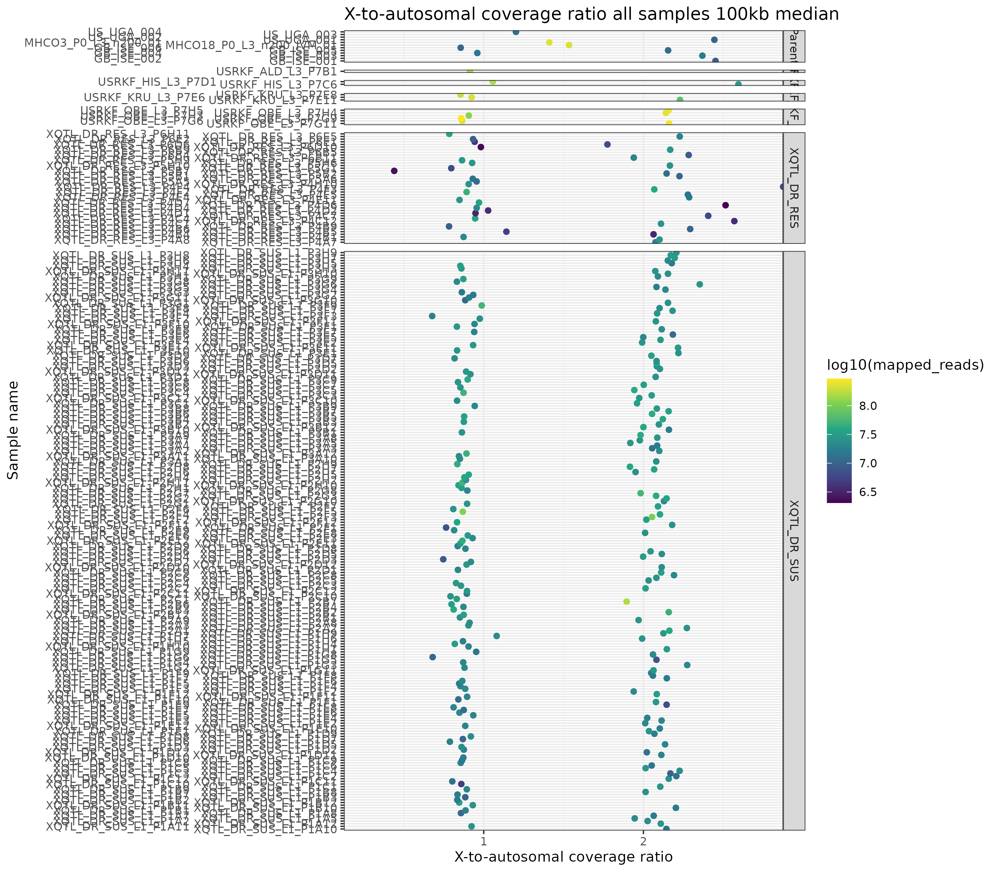

# H.contortus QTL: Coverage analyses


```bash
# make links to all the bams
cd /lustre/scratch125/pam/teams/team333/sd21/haemonchus_contortus/QTL

OUTPUT_DIR=/lustre/scratch125/pam/teams/team333/sd21/haemonchus_contortus/QTL/05_ANALYSIS/COVERAGE
find ~+ -type f -name '*.bam*' -exec ln -vs "{}" $OUTPUT_DIR/ ';'
rm BLANK*

# switch directories
cd /lustre/scratch125/pam/teams/team333/sd21/haemonchus_contortus/QTL/05_ANALYSIS/COVERAGE

# get Hcon annotation from WBPS
wget https://ftp.ebi.ac.uk/pub/databases/wormbase/parasite/releases/WBPS18/species/haemonchus_contortus/PRJEB506/haemonchus_contortus.PRJEB506.WBPS18.annotations.gff3.gz


#generate the bed file for exons
zcat haemonchus_contortus.PRJEB506.WBPS18.annotations.gff3.gz | grep "exon" | awk -F'[:\t]' '{print $1, $4, $5}' OFS="\t" > exon.bed

for i in *.bam; do
    samtools bedcov -Q 20 exon.bed ${i} | awk -F'\t' '{printf $1"\t"$2"\t"$3"\t"$4"\t"$4/($3-$2)"\n"}' OFS="\t" > ${i%.bam}.exon.cov
done

# extract mtDNA and nuclear (median & stddev) data. For exon data.
for i in *.exon.cov; do
     name=${i%.exon.cov};
     autosome=$(grep "hcontortus_chr1_Celeg_TT_arrow_pilon\|hcontortus_chr2_Celeg_TT_arrow_pilon\|hcontortus_chr3_Celeg_TT_arrow_pilon\hcontortus_chr4_Celeg_TT_arrow_pilon\|hcontortus_chr5_Celeg_TT_arrow_pilon)
     ]" ${i} | datamash median 5 sstdev 5 );
     xchromosome=$(grep "hcontortus_chrX_Celeg_TT_arrow_pilon" ${i} | datamash median 5 sstdev 5);
     echo -e "${name}\t${autosome}\t${xchromosome}";
done > autosome_to_Xchromsome_cov_exon.stat

# fix some sample names
sed -i 's/.sorted//g' autosome_to_Xchromsome_cov_exon.stat
```


```R

#plotting the data median and reads mapped all samples
library(tidyverse)

cov_data <- read.table("autosome_to_Xchromsome_cov_exon.stat")

meta_data <- read.table ("sample_metadata.txt", sep="\t")

data <- left_join(cov_data,meta_data,by="V1")
colnames(data) <- c("sample_name", "autosome_cov_median", "autosome_cov_sd", "x_cov_median", "x_cov_sd", "population", "total_reads","mapped_reads")

# filter out failed samples
data <- data %>% filter(x_cov_median/autosome_cov_median > 0.1)

#ggplot(data, aes(reorder(sample_name, x_cov_median/autosome_cov_median*2-0.3), x_cov_median/autosome_cov_median*2-0.3, col=log10(mapped_reads))) +
ggplot(data, aes(sample_name, x_cov_median/autosome_cov_median*2-0.3, col=log10(mapped_reads))) +
    geom_point() +
      scale_color_viridis_c()+
      labs(title="X-to-autosomal coverage ratio all samples 100kb median", x="Sample name", y="X-to-autosomal coverage ratio") +
      theme_bw() + theme(axis.text.x = element_text(angle = 90, vjust = 0.5, hjust=1)) +
      theme_bw(base_size = 10) +
      ylim(0.25,2.75) +
      scale_x_discrete(guide=guide_axis(n.dodge=2)) +
      coord_flip() +
      facet_grid(population~., drop = TRUE, scales = "free", space = "free")

# note: added a 0.3 correction factor as the samples are shift to the right. Suggests a higher coverage on X than expected. Not sure what that means....

ggsave("figure_x-to-autosome_ratio_sexdet_all.png")
ggsave("figure_x-to-autosome_ratio_sexdet_all.pdf",height=10, width=7, useDingbats=FALSE)

```



## summarise number of larvae per sex per group
```R
library(tidyverse)

sex <- data %>%
  group_by(population) %>%
    summarize(
      male = sum(x_cov_median/autosome_cov_median*2-0.3<=1.25),
      female = sum(x_cov_median/autosome_cov_median*2-0.3>=1.75)
      )

sex

  population   male female
  <chr>       <int>  <int>
1 Parent          3      7
2 USRKF_ALD       1      0
3 USRKF_HIS       1      1
4 USRKF_KRU       2      1
5 USRKF_OBE       3      3
6 XQTL_DR_RES    21     21
7 XQTL_DR_SUS   106    113
```
- fairly equal male to female ratios overall