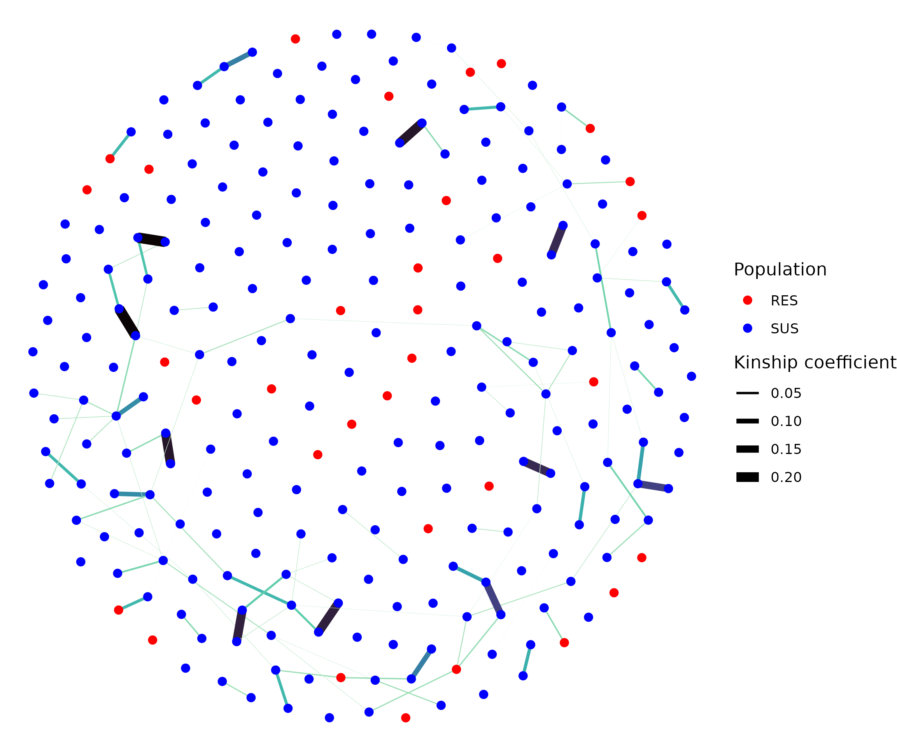

# Kinship 

### Stephen Doyle

```bash
# generate kinship coefficients from the autosomal whole genome data
vcftools \
--vcf HCON_QTL.cohort.2023-12-12.n278.autosomal_variants.recode.vcf \
--relatedness2 \
--max-missing 0.8 \
--out HCON_QTL.cohort.2023-12-12.n278.autosomal_variants


# extract the kinship data for just the F5 samples
cat HCON_QTL.cohort.2023-12-12.n278.autosomal_variants.relatedness2 |\
    grep -v "MHCO" |\
    grep -v "US_UGA" |\
    grep -v "GB" |\
    grep -v "USRKF" |\
    awk '{if($1!=$2) print $1,$2,$7}' OFS="\t" > kinship.data

``````


## make a network plot of the kinship coefficients
- useful references
    - https://ggraph.data-imaginist.com/index.html
    - https://jeremydfoote.com/Communication-and-Social-Networks/resources/ggraph_walkthrough.html

```R
library(ggraph)
library(tidygraph)


nodes <- read.table("metadata.txt", header=T, sep="\t")
links <- read.table("kinship.data", header=T, sep="\t")


# convert kinship coefficients into a coded 1st, 2nd, 3rd degree relatives
# data <-
#      links %>%
#      mutate(KINSHIP = if_else(RELATEDNESS_PHI >= 0.05 & RELATEDNESS_PHI < 0.10125, 0.5,
#                if_else(RELATEDNESS_PHI >= 0.10125 & RELATEDNESS_PHI < 0.1925, 1,
#                if_else(RELATEDNESS_PHI >= 0.1925 & RELATEDNESS_PHI < 0.375, 2, 0))))

# fix any kinship coefficients below 0 to 0
data <-
     links %>%
     mutate(KINSHIP = if_else(RELATEDNESS_PHI >= 0, RELATEDNESS_PHI, 0))

              
# convert data from paired observations to a matrix of observations
data_2 <-
     data %>%
     unique() %>%
     pivot_wider(., id_cols=INDV1, names_from=INDV2, values_from=KINSHIP, values_fill=0)


# clean up matrix
data_3 <-
     data_2 %>%
     remove_rownames %>%
     column_to_rownames(var="INDV1")

data_4 <- as.matrix(data_3)


# make the network graph object
graph <- graph.adjacency(data_4, weighted = TRUE)

# convert the graph object to table format
graph_tbl <- as_tbl_graph(graph)


# add information about the two groups, ie, RES and SUS
pop <- as.data.frame(rownames(data_4)) %>% mutate(new = map(strsplit(rownames(data_4),split = "_"),3)) %>% select(new) %>% as.data.frame()

graph_tbl <- graph_tbl %>%  
    activate(nodes) %>% 
    mutate(pop = unlist(pop))


# make the network graph
graph_tbl %>%  
    ggraph(layout = 'fr') + 
    geom_edge_link(aes(color = weight, edge_linewidth = weight)) + 
    geom_node_point(size = 2, aes(col=pop)) + 
    theme_void() +
    scale_edge_colour_viridis(direction=-1, option="mako") + guides(edge_colour = "none") +
    scale_edge_width_continuous(range=c(0,3), name="Kinship coefficient") +
    scale_colour_manual(values = c("red", "blue"), name="Population")

# save it
ggsave("figure_kinship_network.pdf", height=4.5, width=6, units="in")
ggsave("figure_kinship_network.png")
```
