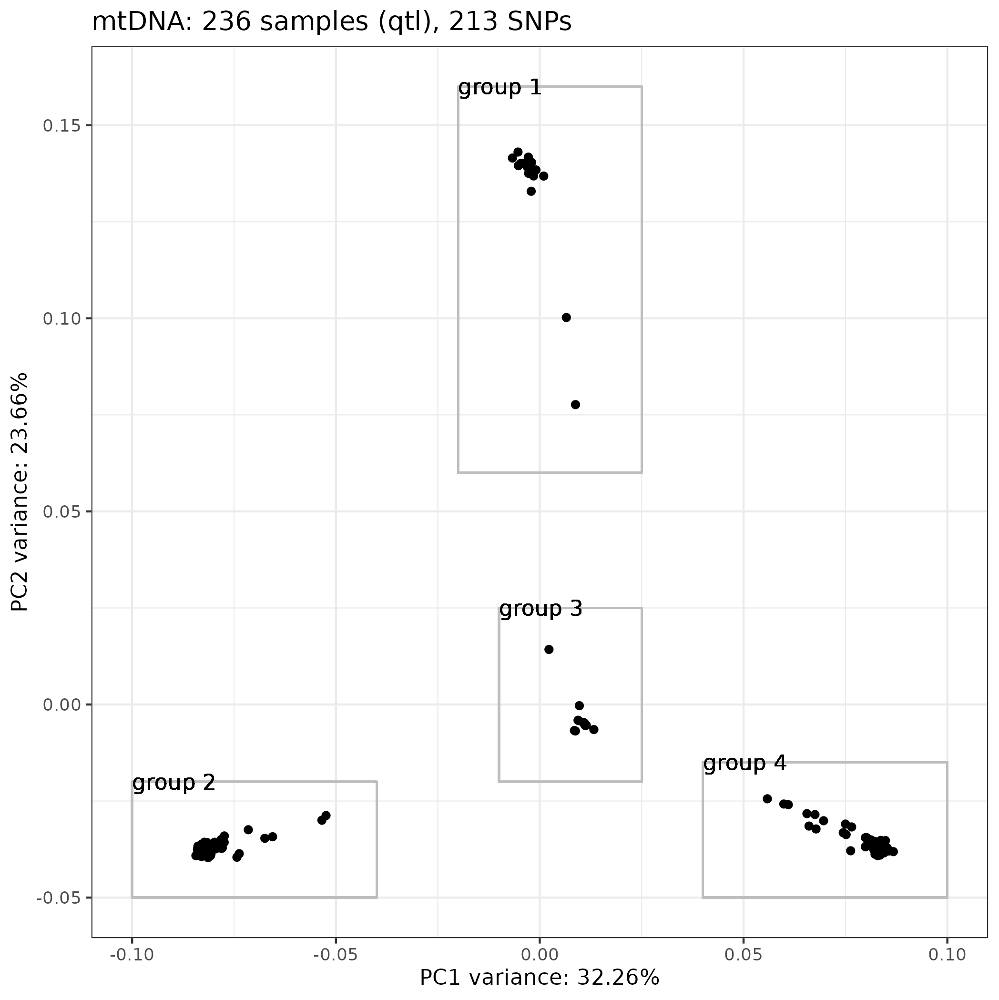

# Hcontortus_qtl: mito-nuclear-interactions

### Stephen Doyle

## background
- PCA analysis of the QTL cohort has reveal at least 3 groups of samples based on mitochondrial variants, suggestign segregating haplotypes from the ISE parental population used to intitiate the cross
- however, the nuclear variants are admixed - this is expected
- I want to now explore if there are any interesting differences in the nuclear genome when comparing samples based on the mtDNA haplogroup
    - expect no major differences
    - however, if there are, it may suggest there is an interaction between mtDNA and nuclear genomes


## working directory
```bash
cd /nfs/users/nfs_s/sd21/lustre_link/haemonchus_contortus/QTL/05_ANALYSIS/MITO-NUCLEAR-INTERACTION

```


## defining the sample sets based on mtDNA groups
- first need to recreate the PCA, and then create lists of sample IDs based on 
```bash
# recreate the mtDNA PCA

ln -s ../PCA/hcontortus_chr_mtDNA_arrow_pilon.missindv0.1.maxmiss1.n256.xqtl.recode.vcf


```

```R
R
#R version 4.0.3

# load libraries
library(tidyverse)
library(SNPRelate)
library(ggrepel)
library(ggsci)


vcf.fn <- "hcontortus_chr_mtDNA_arrow_pilon.missindv0.1.maxmiss1.n256.xqtl.recode.vcf" 

snpgdsVCF2GDS(vcf.fn, "mtDNA_xqtl.gds", method="biallelic.only")

snpgdsClose(genofile)
genofile <- snpgdsOpen("mtDNA_xqtl.gds")

pca <- snpgdsPCA(genofile, num.thread=2, autosome.only=F)

data <- data.frame(sample.id = pca$sample.id,
    EV1 = pca$eigenvect[,1],    # the first eigenvector
    EV2 = pca$eigenvect[,2],    # the second eigenvector
    stringsAsFactors = FALSE)


data <- inner_join(data, population, by="sample.id")


plot <- ggplot(data, aes(EV1, EV2, label=sample.id)) + 
     geom_point() +
     theme_bw() +
     scale_color_npg() +
     labs(title="mtDNA: 236 samples (qtl), 213 SNPs",
          x = paste0("PC1 variance: ",round(pca$varprop[1]*100,digits=2),"%"),
          y = paste0("PC2 variance: ",round(pca$varprop[2]*100,digits=2),"%"))

plot

# add some rectangles to the plot to define groups
plot + 
# top cluster
    geom_rect(aes(xmin=-0.02,xmax=0.025, ymin=0.06 , ymax=0.16), fill=NA, col="grey") + 
    geom_text(aes(x=-0.02,y=0.16, label="group 1"), hjust = 0) +
# bottom left cluster
    geom_rect(aes(xmin=-0.1, xmax=-0.04, ymin=-0.05, ymax=-0.02), fill=NA, col="grey") + 
    geom_text(aes(x=-0.1,y=-0.02, label="group 2"), hjust = 0) +
# middle cluster
    geom_rect(aes(xmin=-0.01, xmax=0.025, ymin=-0.02, ymax=0.025), fill=NA, col="grey") + 
    geom_text(aes(x=-0.01,y=0.025, label="group 3"), hjust = 0) +
# bottom cluster
    geom_rect(aes(xmin=0.04, xmax=0.1, ymin=-0.05, ymax=-0.015), fill=NA, col="grey") + 
    geom_text(aes(x=0.04,y=-0.015, label="group 4"), hjust = 0)

ggsave("figure_mtDNA.pca.mito-groups.png")
ggsave("figure_mtDNA.pca.mito-groups.pdf", height=5, width=5, units="in")

```



```R
# extract sample IDs based on mtDNA groups from PCA data
#--- EV1 = x axis, EV2 = y axis
group1 <- data %>% filter(EV1 > -0.02,
                            EV1 < 0.025,
                            EV2 > 0.06, 
                            EV2 < 0.16) %>% 
                            select(sample.id) %>% 
                            filter(grepl("XQTL",sample.id))

write.table(group1, "mtDNA_group1_sampleIDs_all.list", quote = FALSE, row.names = FALSE, col.names = FALSE)

group2 <- data %>% filter(EV1 > -0.1,
                            EV1 < -0.04,
                            EV2 > -0.05, 
                            EV2 < -0.02)  %>% 
                            select(sample.id) %>% 
                            filter(grepl("XQTL",sample.id))

write.table(group2, "mtDNA_group2_sampleIDs_all.list", quote = FALSE, row.names = FALSE, col.names = FALSE)

group3 <- data %>% filter(EV1 > -0.01,
                            EV1 < 0.025, 
                            EV2 > -0.02, 
                            EV2 < 0.025)  %>% 
                            select(sample.id) %>% 
                            filter(grepl("XQTL",sample.id))

write.table(group3, "mtDNA_group3_sampleIDs_all.list", quote = FALSE, row.names = FALSE, col.names = FALSE)

group4 <- data %>% filter(EV1 > 0.04,
                            EV1 < 0.1, 
                            EV2 > -0.05, 
                            EV2 < -0.015)  %>% 
                            select(sample.id) %>% 
                            filter(grepl("XQTL",sample.id))

write.table(group4, "mtDNA_group4_sampleIDs_all.list", quote = FALSE, row.names = FALSE, col.names = FALSE)

```

```bash
# split into susceptible and resistant groups
for i in *_sampleIDs_all.list; do 
    cat ${i} | grep "XQTL_DR_SUS" > ${i%_all.list}_susceptible.list; 
    cat ${i} | grep "XQTL_DR_RES" > ${i%_all.list}_resistant.list; 
    done

wc -l *_sampleIDs_*list

  41 mtDNA_group1_sampleIDs_all.list
   5 mtDNA_group1_sampleIDs_resistant.list
  36 mtDNA_group1_sampleIDs_susceptible.list
  80 mtDNA_group2_sampleIDs_all.list
  10 mtDNA_group2_sampleIDs_resistant.list
  70 mtDNA_group2_sampleIDs_susceptible.list
  36 mtDNA_group3_sampleIDs_all.list
   9 mtDNA_group3_sampleIDs_resistant.list
  27 mtDNA_group3_sampleIDs_susceptible.list
  75 mtDNA_group4_sampleIDs_all.list
   9 mtDNA_group4_sampleIDs_resistant.list
  66 mtDNA_group4_sampleIDs_susceptible.list
 464 total

# make a populations file for pixy
>mtDNA-groups_pixy_populations.list
for i in *_sampleIDs_*list; do
    name=$(echo ${i} | awk -F '[_\.]' '{print $2"_"$4}');
    awk -v name=$name '{print $1,name}' OFS="\t" ${i} >> mtDNA-groups_pixy_populations.list; 
done

# run pixy
conda activate pixy


ln -s ../../04_VARIANTS/FILTERED/HCON_QTL.cohort.2023-12-12.n278.nuclear_variants.final.recode.vcf

### TESTING - a couple of samples were missing from the old vcf, so had to remove them from the pop list
cat mtDNA-groups_pixy_populations.list | grep -wv "XQTL_DR_SUS_L1_P3B1" | grep -vw "XQTL_DR_SUS_L1_P3D6" | grep -vw "XQTL_DR_SUS_L1_P1C4" > mtDNA-groups_pixy_populations.list2

grep "all" mtDNA-groups_pixy_populations.list2 > mtDNA-groups_pixy_populations_all.list
grep "susceptible" mtDNA-groups_pixy_populations.list2 > mtDNA-groups_pixy_populations_susceptible.list
grep "resistant" mtDNA-groups_pixy_populations.list2 > mtDNA-groups_pixy_populations_resistant.list


bsub.py 10 pixy_mtDNAgroups_dxy_all "pixy --vcf hcontortus_chr5_Celeg_TT_arrow_pilon.raw.vcf.gz --stats dxy --populations mtDNA-groups_pixy_populations_all.list --bypass_invariant_check yes --window_size 10000 --output_prefix mtDNA-groups_all"

bsub.py 10 pixy_mtDNAgroups_dxy_sus "pixy --vcf hcontortus_chr5_Celeg_TT_arrow_pilon.raw.vcf.gz --stats dxy --populations mtDNA-groups_pixy_populations_susceptible.list --bypass_invariant_check yes --window_size 10000 --output_prefix mtDNA-groups_susceptible"

bsub.py 10 pixy_mtDNAgroups_dxy_res "pixy --vcf hcontortus_chr5_Celeg_TT_arrow_pilon.raw.vcf.gz --stats dxy --populations mtDNA-groups_pixy_populations_resistant.list --bypass_invariant_check yes --window_size 10000 --output_prefix mtDNA-groups_resistant"


bsub.py 10 pixy_mtDNAgroups_dxy_all "pixy --vcf hcontortus_chr1_Celeg_TT_arrow_pilon.raw.vcf.gz --stats dxy --populations mtDNA-groups_pixy_populations_all.list --bypass_invariant_check yes --window_size 10000 --output_prefix mtDNA-groups_all_chr1"

bsub.py 10 pixy_mtDNAgroups_dxy_sus "pixy --vcf hcontortus_chr1_Celeg_TT_arrow_pilon.raw.vcf.gz --stats dxy --populations mtDNA-groups_pixy_populations_susceptible.list --bypass_invariant_check yes --window_size 10000 --output_prefix mtDNA-groups_susceptible_chr1"

bsub.py 10 pixy_mtDNAgroups_dxy_res "pixy --vcf hcontortus_chr1_Celeg_TT_arrow_pilon.raw.vcf.gz --stats dxy --populations mtDNA-groups_pixy_populations_resistant.list --bypass_invariant_check yes --window_size 10000 --output_prefix mtDNA-groups_resistant_chr1"


bsub.py 10 pixy_mtDNAgroups_fst_chr1_all "pixy --vcf hcontortus_chr1_Celeg_TT_arrow_pilon.raw.vcf.gz --stats fst --populations mtDNA-groups_pixy_populations_all.list --bypass_invariant_check yes --window_size 10000 --output_prefix mtDNA-groups_all_chr1"
```


```R
library(tidyverse)


data <- read.table("mtDNA-groups_susceptible_dxy.txt", header=T)

ggplot(data, aes(window_pos_1, avg_dxy)) + geom_point(size=0.5) + facet_grid(pop1~pop2)

```

