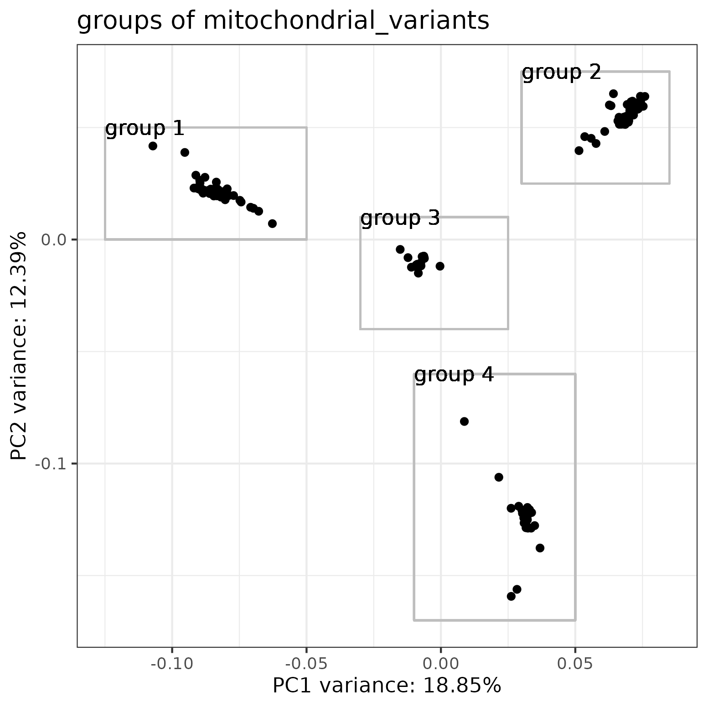

# Hcontortus_qtl: mito-nuclear-interactions

### Stephen Doyle

## background
- PCA analysis of the QTL cohort has reveal at least 3 groups of samples based on mitochondrial variants, suggestign segregating haplotypes from the ISE parental population used to intitiate the cross
- however, the nuclear variants are admixed - this is expected
- I want to now explore if there are any interesting differences in the nuclear genome when comparing samples based on the mtDNA haplogroup
    - expect no major differences
    - however, if there are, it may suggest there is an interaction between mtDNA and nuclear genomes


## working directory
```bash
cd /nfs/users/nfs_s/sd21/lustre_link/haemonchus_contortus/QTL/05_ANALYSIS/PARENT_BIAS/MITO-NUCLEAR-INTERACTION

```


## defining the sample sets based on mtDNA groups
- first need to recreate the PCA, and then create lists of sample IDs based on 
```bash
# recreate the mtDNA PCA

ln -s ../PCA/hcontortus_chr_mtDNA_arrow_pilon.missindv0.1.maxmiss1.n256.xqtl.recode.vcf


```

```R
R
#R version 4.0.3

# load libraries
library(tidyverse)
library(SNPRelate)
library(ggrepel)


vcf.fn <- "hcontortus_chr_mtDNA_arrow_pilon.missindv0.1.maxmiss1.n256.xqtl.recode.vcf" 

snpgdsVCF2GDS(vcf.fn, "mtDNA_xqtl.gds", method="biallelic.only")

snpgdsClose(genofile)
genofile <- snpgdsOpen("mtDNA_xqtl.gds")

pca <- snpgdsPCA(genofile, num.thread=2, autosome.only=F)

data <- data.frame(sample.id = pca$sample.id,
    EV1 = pca$eigenvect[,1],    # the first eigenvector
    EV2 = pca$eigenvect[,2],    # the second eigenvector
    stringsAsFactors = FALSE)


plot <- ggplot(data, aes(EV1, EV2, label=sample.id)) + 
     geom_point() +
     theme_bw() +
     labs(title="groups of mitochondrial_variants",
          x = paste0("PC1 variance: ",round(pca$varprop[1]*100,digits=2),"%"),
          y = paste0("PC2 variance: ",round(pca$varprop[2]*100,digits=2),"%"))

plot

# add some rectangles to the plot to define groups
plot + 
# top left cluster
    geom_rect(aes(xmin=-0.125,xmax=-0.05, ymin=0 , ymax=0.05), fill=NA, col="grey") + 
    geom_text(aes(x=-0.125,y=0.05, label="group 1"), hjust = 0) +
# top right cluster
    geom_rect(aes(xmin=0.03, xmax=0.085, ymin=0.025, ymax=0.075), fill=NA, col="grey") + 
    geom_text(aes(x=0.03,y=0.075, label="group 2"), hjust = 0) +
# middle cluster
    geom_rect(aes(xmin=-0.03, xmax=0.025, ymin=-0.04, ymax=0.01), fill=NA, col="grey") + 
    geom_text(aes(x=-0.03,y=0.01, label="group 3"), hjust = 0) +
# bottom cluster
    geom_rect(aes(xmin=-0.01, xmax=0.05, ymin=-0.17, ymax=-0.06), fill=NA, col="grey") + 
    geom_text(aes(x=-0.01,y=-0.06, label="group 4"), hjust = 0)

ggsave("mtDNA.pca.mito-groups.png")
```



```R
# extract sample IDs based on mtDNA groups from PCA data
#--- EV1 = x axis, EV2 = y axis
group1 <- data %>% filter(EV1 < -0.05,
                            EV1 > -0.125, 
                            EV2 > 0, 
                            EV2 < 0.05) %>% 
                            select(sample.id) %>% 
                            filter(grepl("XQTL",sample.id))

write.table(group1, "mtDNA_group1_sampleIDs_all.list", quote = FALSE, row.names = FALSE, col.names = FALSE)

group2 <- data %>% filter(EV1 < 0.085,
                            EV1 > 0.03, 
                            EV2 > 0.025, 
                            EV2 < 0.075)  %>% 
                            select(sample.id) %>% 
                            filter(grepl("XQTL",sample.id))

write.table(group2, "mtDNA_group2_sampleIDs_all.list", quote = FALSE, row.names = FALSE, col.names = FALSE)

group3 <- data %>% filter(EV1 < 0.025,
                            EV1 > -0.03, 
                            EV2 > -0.04, 
                            EV2 < 0.01)  %>% 
                            select(sample.id) %>% 
                            filter(grepl("XQTL",sample.id))

write.table(group3, "mtDNA_group3_sampleIDs_all.list", quote = FALSE, row.names = FALSE, col.names = FALSE)

group4 <- data %>% filter(EV1 < 0.05,
                            EV1 > -0.01, 
                            EV2 > -0.17, 
                            EV2 < -0.06)  %>% 
                            select(sample.id) %>% 
                            filter(grepl("XQTL",sample.id))

write.table(group4, "mtDNA_group4_sampleIDs_all.list", quote = FALSE, row.names = FALSE, col.names = FALSE)

```

```bash
# split into susceptible and resistant groups
for i in *_sampleIDs_all.list; do 
    cat ${i} | grep "XQTL_DR_SUS" > ${i%_all.list}_susceptible.list; 
    cat ${i} | grep "XQTL_DR_RES" > ${i%_all.list}_resistant.list; 
    done

wc -l *_sampleIDs_*list

   78 mtDNA_group1_sampleIDs_all.list
   13 mtDNA_group1_sampleIDs_resistant.list
   65 mtDNA_group1_sampleIDs_susceptible.list
   82 mtDNA_group2_sampleIDs_all.list
   12 mtDNA_group2_sampleIDs_resistant.list
   70 mtDNA_group2_sampleIDs_susceptible.list
   46 mtDNA_group3_sampleIDs_all.list
   18 mtDNA_group3_sampleIDs_resistant.list
   28 mtDNA_group3_sampleIDs_susceptible.list
   45 mtDNA_group4_sampleIDs_all.list
    7 mtDNA_group4_sampleIDs_resistant.list
   38 mtDNA_group4_sampleIDs_susceptible.list
  502 total

# make a populations file for pixy
>mtDNA-groups_pixy_populations.list
for i in *_sampleIDs_*list; do
    name=$(echo ${i} | awk -F '[_\.]' '{print $4}');
    awk -v name=$name '{print $1,name}' OFS="\t" ${i} >> mtDNA-groups_pixy_populations.list; 
done

# run pixy
conda activate pixy


### TEMP FILE FOR TESTING
ln -s ../PARENT_BIAS/hcontortus_chr1_Celeg_TT_arrow_pilon.raw.vcf.gz
ln -s ../PARENT_BIAS/hcontortus_chr1_Celeg_TT_arrow_pilon.raw.vcf.gz.tbi

ln -s ../PARENT_BIAS/hcontortus_chr5_Celeg_TT_arrow_pilon.raw.vcf.gz
ln -s ../PARENT_BIAS/hcontortus_chr5_Celeg_TT_arrow_pilon.raw.vcf.gz.tbi

### TESTING - a couple of samples were missing from the old vcf, so had to remove them from the pop list
cat mtDNA-groups_pixy_populations.list | grep -wv "XQTL_DR_SUS_L1_P3B1" | grep -vw "XQTL_DR_SUS_L1_P3D6" | grep -vw "XQTL_DR_SUS_L1_P1C4" > mtDNA-groups_pixy_populations.list2

bsub.py 10 pixy_mtDNAgroups_dxy "pixy --vcf hcontortus_chr5_Celeg_TT_arrow_pilon.raw.vcf.gz --stats dxy --populations mtDNA-groups_pixy_populations.list2 --bypass_invariant_check yes --window_size 10000"
```

Exception: ('[pixy] ERROR: the following samples are listed in the population file but not in the VCF: ', ['XQTL_DR_SUS_L1_P3B1', 'XQTL_DR_SUS_L1_P3D6', 'XQTL_DR_SUS_L1_P1C4'])