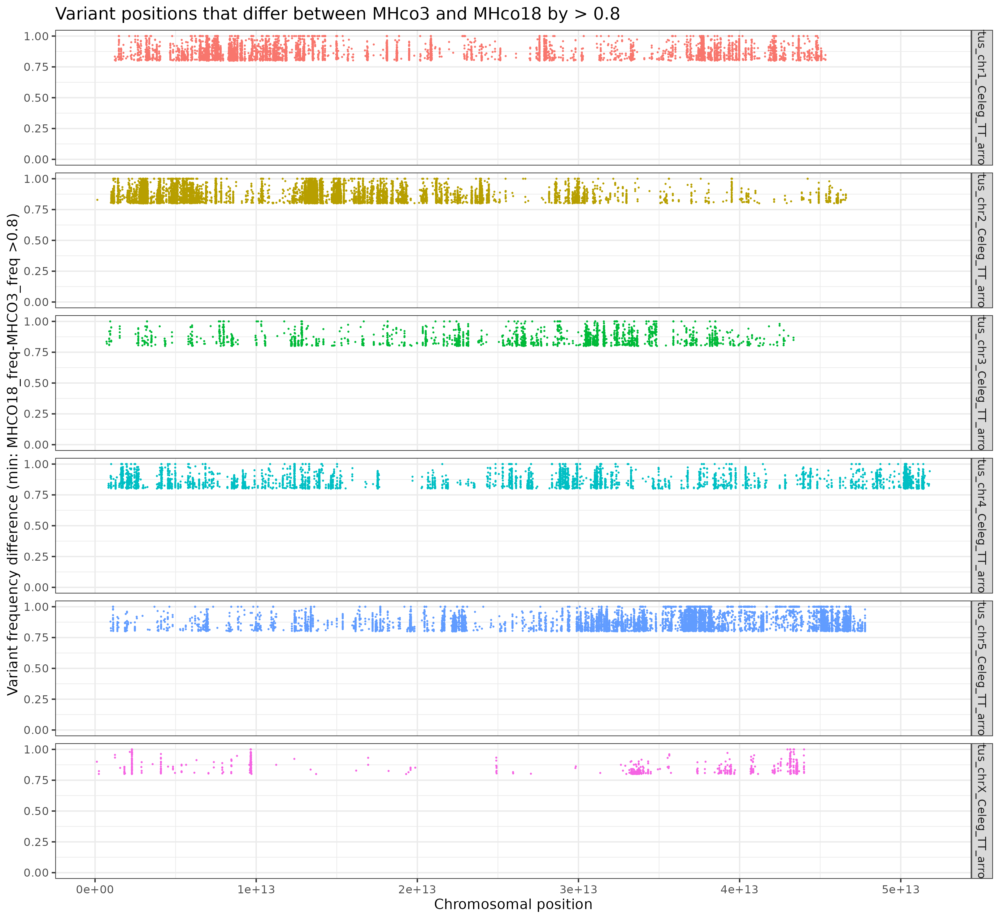
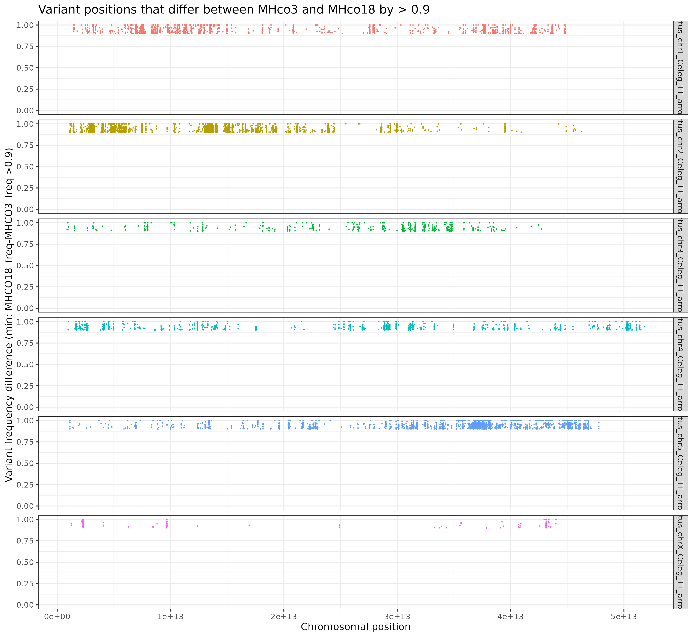

# H.contortus QTL: Parental bias 

### Author: Stephen Doyle

- the XQTL progeny sequenced is the F5 generation of the cross between MHco3 and MHco18
- therefore, we'd expect that by this time point, after multiple rounds of passage, mating, and recombination, that the genomes would be sufficiently admixed
- however, there might be parts of the genome, that, for whatever reason might look more like one or the other parents, if there is some degree of "hidden" selection going on
    - this this is the case, it would be interesting to know what genes might be being selected for


### Aim
- to determine if there is parental allele bias
- to determine if there is mito-nuclear discordance based on mitochondrial haplotype


### Approach
- identify variants that are fixed between parental strains, and then determine if they are segregating as expected in the cross
    - as expected might mean intermediate allele frequencies
    - it might also mean stable under hardy weinberg equilibrium
- for the haplotype analysis, scan genome-wide between groups based on the mtDNA grouping.


## Identify variants with an allelic bias between the parental MHco3 and MHco18 strains
### Calculate allele frequencies of the parental strains
```bash 
# working dir 
cd /nfs/users/nfs_s/sd21/lustre_link/haemonchus_contortus/QTL/05_ANALYSIS/PARENT_BIAS

# get BAMs of the parental strains - these are from the XQTL paper (Doyle et al 2022 Cell Reports) and derived from pools of 200 larvae
ln -s ../../QTL_MAPPING/MHCO3_P0_L3_n200_01/MHCO3_P0_L3_n200_01.bam
ln -s ../../QTL_MAPPING/MHCO3_P0_L3_n200_01/MHCO3_P0_L3_n200_01.bam.bai
ln -s ../../QTL_MAPPING/MHCO18_P0_L3_n200_IVM_01/MHCO18_P0_L3_n200_IVM_01.bam
ln -s ../../QTL_MAPPING/MHCO18_P0_L3_n200_IVM_01/MHCO18_P0_L3_n200_IVM_01.bam.bai


# calculate variant frequency and coverage of the two parental strains
#-- using grenedalf, whcih is great new tool for poolseq data, and replacement for popoolation2

module load grenedalf/0.2.0

bsub.py --queue long 10 grenedalf_freq \
"grenedalf frequency \
    --write-sample-coverage \
    --write-sample-alt-freq \
    --write-total-frequency \
    --sam-min-map-qual 30 \
    --sam-min-base-qual 30 \
    --file-prefix MHCO3_v_MHCO18_pools \
    --separator-char tab \
    --sam-path MHCO3_P0_L3_n200_01.bam \
    --sam-path MHCO18_P0_L3_n200_IVM_01.bam"


# once completed, calculate median coverage of each group
#--- want this data, as coverage will be variable, and allele frequencies will be somewhat biased by low coverage
head -n 10000000 MHCO3_v_MHCO18_poolsfrequency.csv | datamash --header-in median 5,7

#> MHCO18   MHCO3
#> 58	72
```

### Identify variants that polarise the two strains
- need to decide
    - a sensible allele frequency difference - decided on a difference of 0.8
    - a minimum coverage - decided on 1/3 of the median read depth

```bash
# checking variants with biased allele frequency
#-- freq diff = 0.8
#-- min coverage = 0.33 * median
awk '{print $1,$2,$8,$7,$6,$5,$6-$8}' OFS="\t" MHCO3_v_MHCO18_poolsfrequency.csv |\
    awk '{if($7>0.8 && $4>23 && $6>19) print}' OFS="\t" |\
    cut -f1 | sort | uniq -c

# #CHR POS MHCO3_freq MHCO3_cov MHCO18_freq MHCO18_cov diff(MHCO18_freq-MHCO3_freq)

# 0.8 cutoff - 35711 total
   7024 hcontortus_chr1_Celeg_TT_arrow_pilon
  12695 hcontortus_chr2_Celeg_TT_arrow_pilon
   2247 hcontortus_chr3_Celeg_TT_arrow_pilon
   4808 hcontortus_chr4_Celeg_TT_arrow_pilon
   8244 hcontortus_chr5_Celeg_TT_arrow_pilon
    693 hcontortus_chrX_Celeg_TT_arrow_pilon 

# also tested a 0.9 cutoff, to check variant numbers
awk '{print $1,$2,$8,$7,$6,$5,$6-$8}' OFS="\t" MHCO3_v_MHCO18_poolsfrequency.csv |\
    awk '{if($7>0.9 && $4>23 && $6>19) print}' OFS="\t" |\
    cut -f1 | sort | uniq -c

# 0.9 cutoff - 10706 total
   2166 hcontortus_chr1_Celeg_TT_arrow_pilon
   3721 hcontortus_chr2_Celeg_TT_arrow_pilon
    568 hcontortus_chr3_Celeg_TT_arrow_pilon
   1282 hcontortus_chr4_Celeg_TT_arrow_pilon
   2811 hcontortus_chr5_Celeg_TT_arrow_pilon
    158 hcontortus_chrX_Celeg_TT_arrow_pilon


# checking what the distribution of SNPs look like - extract the postions for plotting
awk '{print $1,$2,$8,$7,$6,$5,$6-$8}' OFS="\t" MHCO3_v_MHCO18_poolsfrequency.csv |    awk '{if($7>0.8 && $4>23 && $6>19) print $1,$2,$7}' OFS="\t" > MHCO3_v_MHCO18_poolsfrequency.0.8freq.pos

awk '{print $1,$2,$8,$7,$6,$5,$6-$8}' OFS="\t" MHCO3_v_MHCO18_poolsfrequency.csv |    awk '{if($7>0.9 && $4>23 && $6>19) print $1,$2,$7}' OFS="\t" > MHCO3_v_MHCO18_poolsfrequency.0.9freq.pos
```
### make a plot
```R
library(tidyverse)


data_0.8 <- read.table("MHCO3_v_MHCO18_poolsfrequency.0.8freq.pos", header=F)

plot_0.8 <- ggplot(data_0.8, aes(V2*1e6,V3,col=V1)) + 
    geom_point(size=0.1) + 
    facet_grid(V1~.) + 
    ylim(0,1) +
    theme_bw() +
    guides(color = FALSE) +
    labs(title="Variant positions that differ between MHco3 and MHco18 by > 0.8", 
        y="Variant frequency difference (min: MHCO18_freq-MHCO3_freq >0.8)", 
        x="Chromosomal position")
plot_0.8

ggsave("MHCO3_v_MHCO18_poolsfrequency.0.8freq.pos.pdf", height=7, width=7)
ggsave("MHCO3_v_MHCO18_poolsfrequency.0.8freq.pos.png")

data_0.9 <- read.table("MHCO3_v_MHCO18_poolsfrequency.0.9freq.pos", header=F)

plot_0.9 <- ggplot(data_0.9, aes(V2*1e6,V3,col=V1)) + 
    geom_point(size=0.1) + 
    facet_grid(V1~.) + 
    ylim(0,1) +
    theme_bw() +
    guides(color = FALSE) +
    labs(title="Variant positions that differ between MHco3 and MHco18 by > 0.9", 
        y="Variant frequency difference (min: MHCO18_freq-MHCO3_freq >0.9)", 
        x="Chromosomal position")
plot_0.9

ggsave("MHCO3_v_MHCO18_poolsfrequency.0.9freq.pos.pdf", height=7, width=7)
ggsave("MHCO3_v_MHCO18_poolsfrequency.0.9freq.pos.png")
```




