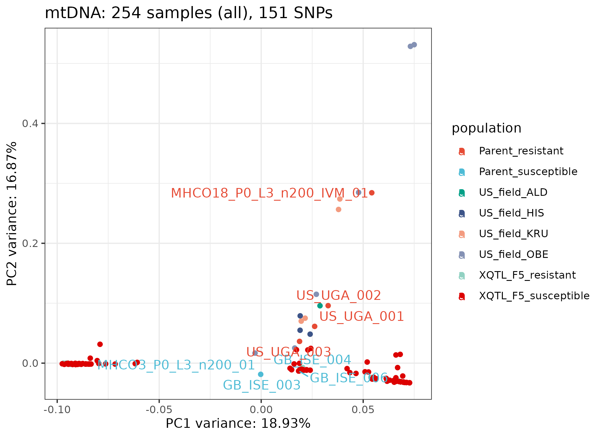
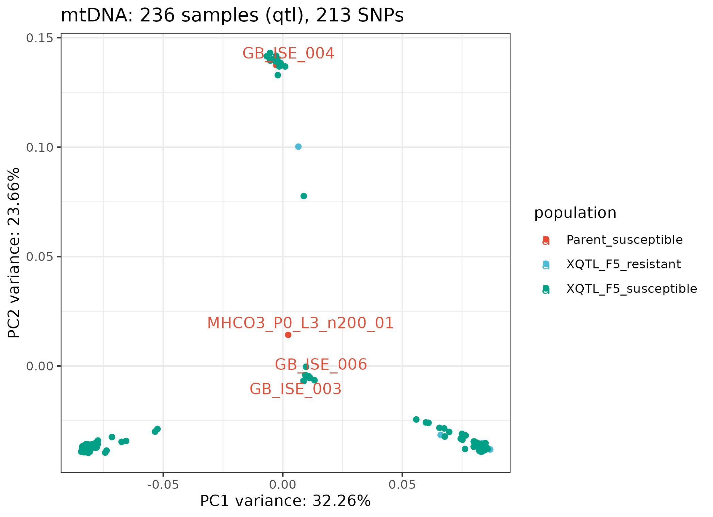

# PCA of nuclear and mitochondrial variants

### Stephen Doyle

```bash
cd /lustre/scratch125/pam/teams/team333/sd21/haemonchus_contortus/QTL/05_ANALYSIS/PCA

```

## mtDNA variants
- Filter variants to keep subsets of samples
```bash

# mtDNA variants
ln -s ../../04_VARIANTS/FILTERED/HCON_QTL.cohort.2023-12-12.n278.mito_variants.final.recode.vcf mito.vcf

# group 1 - all samples with <0.25 missingness
vcftools --vcf mito.vcf --missing-indv

cat out.imiss | awk '{if($5<0.25) print $1}' > keep.list

vcftools --gzvcf mito.vcf --keep keep.list --max-missing 1 --remove-indels --recode --out hcontortus_chr_mtDNA_arrow_pilon.missindv0.1.maxmiss1.n278

#> After filtering, kept 254 out of 277 Individuals
#> After filtering, kept 151 out of a possible 632 Sites


# group 1 - XQTL only samples and the susceptible parental population
grep "XQTL\|MHCO3\|GB_ISE" keep.list > keep.XQTL.list

vcftools --gzvcf mito.vcf   --keep keep.XQTL.list  --max-missing 1 --remove-indels --recode --out hcontortus_chr_mtDNA_arrow_pilon.missindv0.1.maxmiss1.n256.xqtl

#> After filtering, kept 236 out of 277 Individuals
#> After filtering, kept 284 out of a possible 632 Sites
```


## Make some plots
```R
library(tidyverse)
library(SNPRelate)
library(ggrepel)
library(ggsci)


vcf.fn <- "hcontortus_chr_mtDNA_arrow_pilon.missindv0.1.maxmiss1.n278.recode.vcf" 

snpgdsVCF2GDS(vcf.fn, "mtDNA.gds", method="biallelic.only")

snpgdsClose(genofile)
genofile <- snpgdsOpen("mtDNA.gds")

pca <- snpgdsPCA(genofile, num.thread=2, autosome.only=F)

data <- data.frame(sample.id = pca$sample.id,
    EV1 = pca$eigenvect[,1],    # the first eigenvector
    EV2 = pca$eigenvect[,2],    # the second eigenvector
    stringsAsFactors = FALSE)


population <- read.table("sample-id_populations.txt", header=T, sep="\t") 

data <- inner_join(data, population, by="sample.id")


ggplot(data, aes(EV1, EV2, colour=population, label=sample.id)) + 
     geom_point() +
     theme_bw() +
     scale_color_npg() +
     geom_text_repel(data = subset(data, population == "Parent_susceptible"), max.overlaps = Inf) +
     geom_text_repel(data = subset(data, population == "Parent_resistant"), max.overlaps = Inf) +
     labs(title="mtDNA: 254 samples (all), 151 SNPs",
          x = paste0("PC1 variance: ",round(pca$varprop[1]*100,digits=2),"%"),
          y = paste0("PC2 variance: ",round(pca$varprop[2]*100,digits=2),"%"))

ggsave("figure_pca_mDNA_snps_allsamples.png")
ggsave("figure_pca_mDNA_snps_allsamples.pdf", height=4.5, width=6, units="in")

```



```R
# PCA using just the F5 generation and susceptible parental samples
vcf.fn <- "hcontortus_chr_mtDNA_arrow_pilon.missindv0.1.maxmiss1.n256.xqtl.recode.vcf" 

snpgdsVCF2GDS(vcf.fn, "mtDNA_xqtl.gds", method="biallelic.only")

snpgdsClose(genofile)
genofile <- snpgdsOpen("mtDNA_xqtl.gds")

pca <- snpgdsPCA(genofile, num.thread=2, autosome.only=F)

data <- data.frame(sample.id = pca$sample.id,
    EV1 = pca$eigenvect[,1],    # the first eigenvector
    EV2 = pca$eigenvect[,2],    # the second eigenvector
    stringsAsFactors = FALSE)


population <- read.table("sample-id_populations.txt", header=T, sep="\t") 

data <- inner_join(data, population, by="sample.id")


ggplot(data, aes(EV1, EV2, colour=population, label=sample.id)) + 
     geom_point() +
     theme_bw() +
     scale_color_npg() +
     geom_text_repel(data = subset(data, population == "Parent_susceptible"), max.overlaps = Inf) +
     labs(title="mtDNA: 236 samples (qtl), 213 SNPs",
          x = paste0("PC1 variance: ",round(pca$varprop[1]*100,digits=2),"%"),
          y = paste0("PC2 variance: ",round(pca$varprop[2]*100,digits=2),"%"))

ggsave("figure_pca_mDNA_snps_xqtl_samples.png")
ggsave("figure_pca_mDNA_snps_xqtl_samples.pdf", height=4.5, width=6, units="in")

```




## Nuclear variants
- Filter variants to keep subsets of samples

```bash
# mtDNA variants

ln -s ../../04_VARIANTS/FILTERED/HCON_QTL.cohort.2023-12-12.n278.autosomal_variants.recode.vcf autosome.vcf

# group 1 - all samples with <0.25 missingness
vcftools --vcf autosome.vcf --missing-indv

cat out.imiss | awk '{if($5<0.5) print $1}' > keep.list

vcftools --gzvcf autosome.vcf --keep keep.list --max-missing 0.8 --remove-indels --recode --out autosome.all

#> After filtering, kept 254 out of 277 Individuals
#> After filtering, kept 151 out of a possible 632 Sites


# group 1 - XQTL only samples and the susceptible parental population
grep "XQTL\|MHCO3\|GB_ISE" keep.list > keep.XQTL.list

vcftools --gzvcf autosome.vcf  --keep keep.XQTL.list  --max-missing 1 --remove-indels --recode --out autosome.qtl

#> After filtering, kept 236 out of 277 Individuals
#> After filtering, kept 284 out of a possible 632 Sites
```


## nuclear variants

```bash
ln -s ../../04_VARIANTS/FILTERED/HCON_QTL.cohort.2023-12-12.n278.autosomal_variants.recode.vcf


```


## Make some plots
```R
library(tidyverse)
library(SNPRelate)
library(ggrepel)
library(ggsci)


vcf.fn <- "autosome.all.recode.vcf" 

snpgdsVCF2GDS(vcf.fn, "autosome.all.gds", method="biallelic.only")

snpgdsClose(genofile)
genofile <- snpgdsOpen("autosome.all.gds")

# LD pruning
snpset <- snpgdsLDpruning(genofile, ld.threshold=0.2, autosome.only=F)
snpset.id <- unlist(unname(snpset))

pca <- snpgdsPCA(genofile, num.thread=2, autosome.only=F, snp.id=snpset.id)

data <- data.frame(sample.id = pca$sample.id,
    EV1 = pca$eigenvect[,1],    # the first eigenvector
    EV2 = pca$eigenvect[,2],    # the second eigenvector
    stringsAsFactors = FALSE)


population <- read.table("sample-id_populations.txt", header=T, sep="\t") 

data <- inner_join(data, population, by="sample.id")


ggplot(data, aes(EV1, EV2, colour=population, label=sample.id)) + 
     geom_point() +
     theme_bw() +
     scale_color_npg() +
     geom_text_repel(data = subset(data, population == "Parent_susceptible"), max.overlaps = Inf) +
     geom_text_repel(data = subset(data, population == "Parent_resistant"), max.overlaps = Inf) +
     labs(title="autosomal SNPs: 245 samples (all), 31,951 SNPs",
          x = paste0("PC1 variance: ",round(pca$varprop[1]*100,digits=2),"%"),
          y = paste0("PC2 variance: ",round(pca$varprop[2]*100,digits=2),"%"))

ggsave("figure_pca_autosome_snps_allsamples.png")
ggsave("figure_pca_autosome_snps_allsamples.pdf", height=4.5, width=6, units="in")

```


```R
library(tidyverse)
library(SNPRelate)
library(ggrepel)
library(ggsci)


vcf.fn <- "autosome.qtl.recode.vcf" 

snpgdsVCF2GDS(vcf.fn, "autosome.qtl.gds", method="biallelic.only")

snpgdsClose(genofile)
genofile <- snpgdsOpen("autosome.qtl.gds")

# LD pruning
snpset <- snpgdsLDpruning(genofile, ld.threshold=0.2, autosome.only=F)
snpset.id <- unlist(unname(snpset))

pca <- snpgdsPCA(genofile, num.thread=2, autosome.only=F, snp.id=snpset.id)

data <- data.frame(sample.id = pca$sample.id,
    EV1 = pca$eigenvect[,1],    # the first eigenvector
    EV2 = pca$eigenvect[,2],    # the second eigenvector
    stringsAsFactors = FALSE)


population <- read.table("sample-id_populations.txt", header=T, sep="\t") 

data <- inner_join(data, population, by="sample.id")


ggplot(data, aes(EV1, EV2, colour=population, label=sample.id)) + 
     geom_point() +
     theme_bw() +
     scale_color_npg() +
     geom_text_repel(data = subset(data, population == "Parent_susceptible"), max.overlaps = Inf) +
     geom_text_repel(data = subset(data, population == "Parent_resistant"), max.overlaps = Inf) +
     labs(title="autosomal SNPs: 235 samples (all), 6,194 SNPs",
          x = paste0("PC1 variance: ",round(pca$varprop[1]*100,digits=2),"%"),
          y = paste0("PC2 variance: ",round(pca$varprop[2]*100,digits=2),"%"))

ggsave("figure_pca_autosome_snps_allsamples.png")
ggsave("figure_pca_autosome_snps_allsamples.pdf", height=4.5, width=6, units="in")

```
