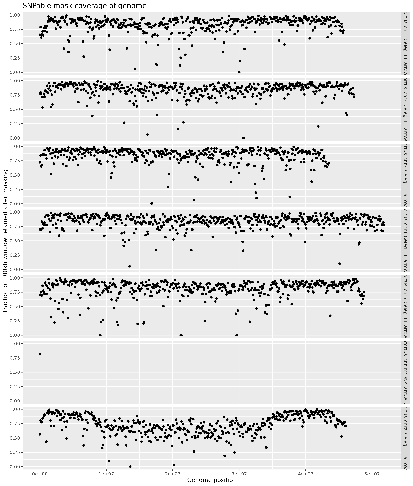

# hcontortus_qtl: variant filtering

### Stephen Doyle


## SNPable
- Using Heng Li's "SNPable regions" to identify unique regions fo the genome in which mapping tends to be more reliable. 
- http://lh3lh3.users.sourceforge.net/snpable.shtml

```bash
cd /nfs/users/nfs_s/sd21/lustre_link/haemonchus_contortus/QTL/04_VARIANTS/FILTERED/SNPABLE

ln -s ../../../01_REFERENCE/HAEM_V4_final.chr.fa

# make reads from the reference genome
~sd21/lustre_link/software/SNP_CALLING/seqbility-20091110/splitfa HAEM_V4_final.chr.fa 35 | split -l 20000000

# index the reference
bwa index HAEM_V4_final.chr.fa

# map the reads generated from the reference back to the reference
echo -e 'for i in x*; do 
    bwa aln -R 1000000 -O 3 -E 3 HAEM_V4_final.chr.fa ${i} > ${i}.sai; 
    done' > run_bwa.sh

bsub.py 10 bwaaln "bash ./run_bwa.sh"

for i in *sai; do 
    bwa samse -f ${i%.sai}.out.sam HAEM_V4_final.chr.fa ${i} ${i%.sai}; 
    done

# once mapping is completed, compress to save space
gzip *out.sam

# make the raw mask
#gzip -dc x??.out.sam.gz | ~/lustre_link/software/SNP_CALLING/seqbility-20091110/gen_raw_mask.pl > rawMask_35.fa
cat *sam | ~/lustre_link/software/SNP_CALLING/seqbility-20091110/gen_raw_mask.pl > rawMask_35.fa

# make the final mask
~/lustre_link/software/SNP_CALLING/seqbility-20091110/gen_mask -l 35 -r 0.5 rawMask_35.fa > mask_35_50.fa

5698971, 30981882, 16144544, 230613911, 245124955
0.830322, 0.888450, 0.882569

# make bed files per chromosome of the category 3 positions,
module load ISG/python/2.7.16

python ~/lustre_link/haemonchus_contortus/QTL/04_VARIANTS/FILTERED/SNPABLE/makeMappabilityMask.py

zcat *.mask.bed.gz | sort -k1,1V -k2,2n > snpable.mask.bed

# clean up
rm *sam *sai x*

# position categories
# c=3: the majortiy of overlapping 35-mers are mapped uniquely and without 1-mismatch (or 1-difference, depending on the BWA command line) hits.
# c=2: the majority of overlapping 35-mers are unique and c!=3.
# c=1: the majority of overlapping 35-mers are non-unique.
# c=0: all the 35-mers overlapping x cannot be mapped due to excessive ambiguous bases.

# count how many positions for each position in the genome
for i in 0 1 2 3; do
     echo -e "SNPtype: ${i}";
     cat mask_35_50.fa | grep -v ">" | grep -o "${i}" | wc -l;
done

SNPtype: 0
5698971
SNPtype: 1
30981882
SNPtype: 2
16144544
SNPtype: 3
230613911


283439308
# clean up
rm *sam *sai x*


# check coverage of kept regions

samtools faidx HAEM_V4_final.chr.fa

cat HAEM_V4_final.chr.fa.fai | cut -f1,2 > HAEM_V4_final.chr.genome

bedtools makewindows -g HAEM_V4_final.chr.genome -w 100000 > HAEM_V4_final.chr.100k.bed

bedtools coverage -a HAEM_V4_final.chr.100k.bed -b snpable.mask.bed > HAEM_V4_final.chr.100k.snpable.coverage
```

```R
library(tidyverse)

data <- read.table("HAEM_V4_final.chr.100k.snpable.coverage", header=F)

ggplot(data, aes(V2,V7)) + 
    geom_point() + 
    facet_grid(V1~.) +
    labs(title="SNPable mask coverage of genome", x="Genome position", y="Fraction of 100kb window retained after masking")

ggsave("figure_snpable_mask_coverage_of_genome.png")
```



```bash
cd /nfs/users/nfs_s/sd21/lustre_link/haemonchus_contortus/QTL/04_VARIANTS/FILTERED

ln -s ../gatk_hc_HCON_QTL/GATK_HC_MERGED/HCON_QTL.cohort.2023-12-12.vcf.gz
ln -s ../gatk_hc_HCON_QTL/GATK_HC_MERGED/HCON_QTL.cohort.2023-12-12.vcf.gz.tbi

# select only well mapped samples
vcftools \
--gzvcf HCON_QTL.cohort.2023-12-12.vcf.gz \
--keep mapping_pos_keeplist.txt \
--recode --recode-INFO-all \
--out HCON_QTL.cohort.2023-12-12.n278 \
--stdout | bgzip -c > HCON_QTL.cohort.2023-12-12.n278.vcf.gz

tabix HCON_QTL.cohort.2023-12-12.n278.vcf.gz
```


## Querying SNP and INDEL QC profiles to determine thresholds for filters
- Adapted from [https://evodify.com/gatk-in-non-model-organism/]
```bash
# load gatk
module load gatk/4.1.4.1


cd /nfs/users/nfs_s/sd21/lustre_link/haemonchus_contortus/QTL/04_VARIANTS/FILTERED

# set reference, vcf, and mitochondrial contig
REFERENCE=HAEM_V4_final.chr.fa
VCF=HCON_QTL.cohort.2023-12-12.n278.vcf.gz
MITOCHONDRIAL_CONTIG=hcontortus_chr_mtDNA_arrow_pilon
KEEP_LIST=mapping_pos_keeplist.txt

samtools faidx ${REFERENCE}
samtools dict HAEM_V4_final.chr.fa > HAEM_V4_final.chr.dict

# select nuclear SNPs
bsub.py 1 select_nuclearSNPs "gatk SelectVariants \
--reference ${REFERENCE} \
--variant ${VCF} \
--select-type-to-include SNP \
--exclude-intervals ${MITOCHONDRIAL_CONTIG} \
--output ${VCF%.vcf.gz}.nuclearSNPs.vcf"

# select nuclear INDELs
bsub.py 1 select_nuclearINDELs "gatk SelectVariants \
--reference ${REFERENCE} \
--variant ${VCF} \
--select-type-to-include INDEL \
--exclude-intervals ${MITOCHONDRIAL_CONTIG} \
--output ${VCF%.vcf.gz}.nuclearINDELs.vcf"

# select mitochondrial SNPs
bsub.py 1 select_mitoSNPs "gatk SelectVariants \
--reference ${REFERENCE} \
--variant ${VCF} \
--select-type-to-include SNP \
--intervals ${MITOCHONDRIAL_CONTIG} \
--output ${VCF%.vcf.gz}.mitoSNPs.vcf"

# select mitochondrial INDELs
bsub.py 1 select_mitoINDELs "gatk SelectVariants \
--reference ${REFERENCE} \
--variant ${VCF} \
--select-type-to-include INDEL \
--intervals ${MITOCHONDRIAL_CONTIG} \
--output ${VCF%.vcf.gz}.mitoINDELs.vcf"


# make a table of nuclear SNP data
bsub.py 1 select_nuclearSNPs_table "gatk VariantsToTable \
--reference ${REFERENCE} \
--variant ${VCF%.vcf.gz}.nuclearSNPs.vcf \
--fields CHROM --fields POS --fields QUAL --fields QD --fields DP --fields MQ --fields MQRankSum --fields FS --fields ReadPosRankSum --fields SOR \
--output GVCFall_nuclearSNPs.table"

# make a table of nuclear INDEL data data
bsub.py 1 select_nuclearINDELs_table "gatk VariantsToTable \
--reference ${REFERENCE} \
--variant ${VCF%.vcf.gz}.nuclearINDELs.vcf \
--fields CHROM --fields POS --fields QUAL --fields QD --fields DP --fields MQ --fields MQRankSum --fields FS --fields ReadPosRankSum --fields SOR \
--output GVCFall_nuclearINDELs.table"

# make a table of mito SNP data
bsub.py  1 select_mitoSNPs_table "gatk VariantsToTable \
--reference ${REFERENCE} \
--variant ${VCF%.vcf.gz}.mitoSNPs.vcf \
--fields CHROM --fields POS --fields QUAL --fields QD --fields DP --fields MQ --fields MQRankSum --fields FS --fields ReadPosRankSum --fields SOR \
--output GVCFall_mitoSNPs.table"

# make a table of mito INDEL data data
bsub.py  1 select_mitoINDELs_table "gatk VariantsToTable \
--reference ${REFERENCE} \
--variant ${VCF%.vcf.gz}.mitoINDELs.vcf \
--fields CHROM --fields POS --fields QUAL --fields QD --fields DP --fields MQ --fields MQRankSum --fields FS --fields ReadPosRankSum --fields SOR \
--output GVCFall_mitoINDELs.table"


# make some density plots of the data
bsub.py 10 variant_summaries "Rscript plot_variant_summaries.R"

```

- where "plot_variant_summaries.R" is
```R
# load libraries
library(patchwork)
require(data.table)
library(tidyverse)
library(gridExtra)

VCF_nuclear_snps <- fread('GVCFall_nuclearSNPs.table', header = TRUE, fill=TRUE, na.strings=c("","NA"), sep = "\t")
VCF_nuclear_snps <- sample_frac(VCF_nuclear_snps, 0.2)
VCF_nuclear_indels <- fread('GVCFall_nuclearINDELs.table', header = TRUE, fill=TRUE, na.strings=c("","NA"), sep = "\t")
VCF_nuclear_indels <- sample_frac(VCF_nuclear_indels, 0.2)
dim(VCF_nuclear_snps)
dim(VCF_nuclear_indels)
VCF_nuclear <- rbind(VCF_nuclear_snps, VCF_nuclear_indels)
VCF_nuclear$Variant <- factor(c(rep("SNPs", dim(VCF_nuclear_snps)[1]), rep("Indels", dim(VCF_nuclear_indels)[1])))

VCF_mito_snps <- fread('GVCFall_mitoSNPs.table', header = TRUE, fill=TRUE, na.strings=c("","NA"), sep = "\t")
VCF_mito_indels <- fread('GVCFall_mitoINDELs.table', header = TRUE, fill=TRUE, na.strings=c("","NA"), sep = "\t")
dim(VCF_mito_snps)
dim(VCF_mito_indels)
VCF_mito <- rbind(VCF_mito_snps, VCF_mito_indels)
VCF_mito$Variant <- factor(c(rep("SNPs", dim(VCF_mito_snps)[1]), rep("Indels", dim(VCF_mito_indels)[1])))


snps <- '#A9E2E4'
indels <- '#F4CCCA'

fun_variant_summaries <- function(data, title){
# gatk hardfilter: 
#-- SNP: remove QUAL < 30
#-- INDEL: remove QUAL < 30
QUAL_quant <- quantile(data$QUAL, c(.01,.99), na.rm=T)

QUAL <-
     ggplot(data, aes(x=log10(QUAL), fill=Variant)) +
     geom_density(alpha=.3) +
     geom_vline(xintercept=log10(30), size=0.7, col="red") +
     geom_vline(xintercept=c(log10(QUAL_quant[2]), log10(QUAL_quant[3])), size=0.7, col="blue") +
     #xlim(0,10000) +
     theme_bw() +
     labs(title=paste0(title,": QUAL"))


# DP doesnt have a hardfilter
DP_quant <- quantile(data$DP, c(.01,.99), na.rm=T)

DP <-
     ggplot(data, aes(x=DP, fill=Variant)) +
     geom_density(alpha=0.3) +
     geom_vline(xintercept=DP_quant, col="blue") +
     theme_bw() +
     labs(title=paste0(title,": DP"))


# gatk hardfilter: 
#-- SNP: remove QD < 2
#-- INDEL: remove QD < 2
QD_quant <- quantile(data$QD, c(.01,.99), na.rm=T)

QD <-
     ggplot(data, aes(x=QD, fill=Variant)) +
     geom_density(alpha=.3) +
     geom_vline(xintercept=2, size=0.7, col="red") +
     geom_vline(xintercept=QD_quant, size=0.7, col="blue") +
     theme_bw() +
     labs(title=paste0(title,": QD"))

# gatk hardfilter:
#-- SNP: remove FS > 60
#-- INDEL: remove FS > 200
FS_quant <- quantile(data$FS, c(.01,.99), na.rm=T)

FS <-
     ggplot(data, aes(x=log10(FS), fill=Variant)) +
     geom_density(alpha=.3) +
     geom_vline(xintercept=c(log10(60), log10(200)), size=0.7, col="red") +
     geom_vline(xintercept=log10(FS_quant), size=0.7, col="blue") +
     #xlim(0,250) +
     theme_bw() +
     labs(title=paste0(title,": FS"))

# gatk hardfilter: 
#-- SNP: remove MQ < 40
#-- INDEL: remove MQ < 40
MQ_quant <- quantile(data$MQ, c(.01,.99), na.rm=T)

MQ <-
     ggplot(data, aes(x=MQ, fill=Variant)) + geom_density(alpha=.3) +
     geom_vline(xintercept=40, size=0.7, col="red") +
     geom_vline(xintercept=MQ_quant, size=0.7, col="blue") +
     theme_bw() +
     labs(title=paste0(title,": MQ"))

# gatk hardfilter: 
#-- SNP: remove MQRankSum < -12.5
MQRankSum_quant <- quantile(data$MQRankSum, c(.01,.99), na.rm=T)

MQRankSum <-
     ggplot(data, aes(x=MQRankSum, fill=Variant)) + geom_density(alpha=.3) +
     geom_vline(xintercept=-12.5, size=0.7, col="red") +
     geom_vline(xintercept=MQRankSum_quant, size=0.7, col="blue") +
     theme_bw() +
     labs(title=paste0(title,": MQRankSum"))


# gatk hardfilter: 
#-- SNP: remove SOR > 3 
#-- INDEL: remove SOR > 3
SOR_quant <- quantile(data$SOR, c(.01, .99), na.rm=T)

SOR <-
     ggplot(data, aes(x=SOR, fill=Variant)) +
     geom_density(alpha=.3) +
     geom_vline(xintercept=3, size=1, colour = "red") +
     geom_vline(xintercept=SOR_quant, size=0.7, col="blue") +
     theme_bw() +
     labs(title=paste0(title,": SOR"))

# gatk hardfilter: 
#-- SNP: remove ReadPosRankSum < -8
#-- INDEL: remove ReadPosRankSum < -20
ReadPosRankSum_quant <- quantile(data$ReadPosRankSum, c(.01,.99), na.rm=T)

ReadPosRankSum <-
     ggplot(data, aes(x=ReadPosRankSum, fill=Variant)) +
     geom_density(alpha=.3) +
     geom_vline(xintercept=c(-8,-20), size=1, colour = c(snps,indels)) +
     xlim(-10, 10) +
     geom_vline(xintercept=ReadPosRankSum_quant, size=0.7, col="blue") +
     theme_bw() +
     labs(title=paste0(title,": ReadPosRankSum"))


plot <- QUAL + DP + QD + FS + MQ + MQRankSum + SOR + ReadPosRankSum + plot_layout(ncol=2)

print(plot)

ggsave(paste0("plot_",title,"_variant_summaries.png"), height=20, width=15, type="cairo")


# generate a table of quantiles for each variant feature
QUAL_quant <- data %>% group_by(Variant) %>% summarise(quants = list(quantile(QUAL, probs = c(0.01,0.05,0.95,0.99),na.rm=T))) %>% unnest_wider(quants)
QUAL_quant$name <- "QUAL"
DP_quant <- data %>% group_by(Variant) %>% summarise(quants = list(quantile(DP, probs = c(0.01,0.05,0.95,0.99),na.rm=T))) %>% unnest_wider(quants)
DP_quant$name <- "DP"
QD_quant <- data %>% group_by(Variant) %>% summarise(quants = list(quantile(QD, probs = c(0.01,0.05,0.95,0.99),na.rm=T))) %>% unnest_wider(quants)
QD_quant$name <- "QD"
FS_quant <- data %>% group_by(Variant) %>% summarise(quants = list(quantile(FS, probs = c(0.01,0.05,0.95,0.99),na.rm=T))) %>% unnest_wider(quants)
FS_quant$name <- "FS"
MQ_quant <- data %>% group_by(Variant) %>% summarise(quants = list(quantile(MQ, probs = c(0.01,0.05,0.95,0.99),na.rm=T))) %>% unnest_wider(quants)
MQ_quant$name <- "MQ"
MQRankSum_quant <- data %>% group_by(Variant) %>% summarise(quants = list(quantile(MQRankSum, probs = c(0.01,0.05,0.95,0.99),na.rm=T))) %>% unnest_wider(quants)
MQRankSum_quant$name <- "MQRankSum"
SOR_quant <- data %>% group_by(Variant) %>% summarise(quants = list(quantile(SOR, probs = c(0.01,0.05,0.95,0.99),na.rm=T))) %>% unnest_wider(quants)
SOR_quant$name <- "SOR"
ReadPosRankSum_quant <- data %>% group_by(Variant) %>% summarise(quants = list(quantile(ReadPosRankSum, probs = c(0.01,0.05,0.95,0.99),na.rm=T))) %>% unnest_wider(quants)
ReadPosRankSum_quant$name <- "ReadPosRankSum"

quantiles <- bind_rows(QUAL_quant,DP_quant, QD_quant, FS_quant, MQ_quant, MQRankSum_quant, SOR_quant, ReadPosRankSum_quant)
quantiles$name <- c("QUAL_Indels","QUAL_SNPs","DP_indels","DP_SNPs", "QD_indels","QD_SNPs", "FS_indels","FS_SNPs", "MQ_indels","MQ_SNPs", "MQRankSum_indels","MQRankSum_SNPs", "SOR_indels","SOR_SNPs","ReadPosRankSum_indels","ReadPosRankSum_SNPs")

png(paste0("table_",title,"_variant_quantiles.png"), width=1000,height=500,bg = "white")
print(quantiles)
grid.table(quantiles)
dev.off()

}

# run mitochondrial variants
fun_variant_summaries(VCF_mito,"mitochondrial")

# run nuclear variants
fun_variant_summaries(VCF_nuclear,"nuclear")
```


## Applying filters to the variants
```bash
# apply filtering to SNPs
WORKING_DIR=/nfs/users/nfs_s/sd21/lustre_link/haemonchus_contortus/QTL/04_VARIANTS/FILTERED
REFERENCE=HAEM_V4_final.chr.fa
VCF=HCON_QTL.cohort.2023-12-12.n278.vcf.gz

bsub.py 1 filter_nuclearSNPs "bcftools view \
--exclude 'QUAL < 36 || INFO/DP < 37 || INFO/DP > 5249 || MQ < 30 || SOR > 7 || QD < 1.4 || FS > 113 || MQRankSum < -4.6 || ReadPosRankSum < -1.9 || ReadPosRankSum > 1.8' \
--output-type z \
--output-file ${VCF%.vcf.gz}.nuclearSNPs.filtered.vcf.gz \
${VCF%.vcf.gz}.nuclearSNPs.vcf"


bsub.py 1 filter_nuclearINDELs "bcftools view \
--exclude 'QUAL < 33.5 || INFO/DP < 294 || INFO/DP > 4286 || MQ < 29.3 || SOR > 7.1 || QD < 1.1 || FS > 112 || MQRankSum < -5.5 || ReadPosRankSum < -2.710 || ReadPosRankSum > 1.830' \
--output-type z \
--output-file ${VCF%.vcf.gz}.nuclearINDELs.filtered.vcf.gz \
${VCF%.vcf.gz}.nuclearINDELs.vcf"

bsub.py 1 filter_mitoSNPs "bcftools view \
--exclude 'QUAL < 36 || INFO/DP < 6674 || INFO/DP > 42624 || MQ < 48 || SOR > 4.6 || QD < 0.17 || FS > 44.3 || MQRankSum < -10.4 || ReadPosRankSum < -3.9 || ReadPosRankSum > 4.1' \
--output-type z \
--output-file ${VCF%.vcf.gz}.mitoSNPs.filtered.vcf.gz \
${VCF%.vcf.gz}.mitoSNPs.vcf"

bsub.py 1 filter_mitoINDELs "bcftools view \
--exclude 'QUAL < 31 || INFO/DP < 4590 || INFO/DP > 42408 || MQ < 43.4 || SOR > 6.3 || QD < 0.1 || FS > 76.2 || ReadPosRankSum < -6.4 || ReadPosRankSum > 3.1' \
--output-type z \
--output-file ${VCF%.vcf.gz}.mitoINDELs.filtered.vcf.gz \
${VCF%.vcf.gz}.mitoINDELs.vcf"


# bsub.py 1 filter_nuclearSNPs "gatk VariantFiltration \
# --reference ${REFERENCE} \
# --variant ${VCF%.vcf.gz}.nuclearSNPs.vcf \
# --filter-expression 'QUAL < 36 || DP < 37 || DP > 5249 || MQ < 30 || SOR > 7 || QD < 1.4 || FS > 113 || MQRankSum < -4.6 || ReadPosRankSum < -1.9 || ReadPosRankSum > 1.8' \
# --filter-name "SNP_filtered" \
# --output ${VCF%.vcf.gz}.nuclearSNPs.filtered.vcf"

# bsub.py 1 filter_nuclearINDELs "gatk VariantFiltration \
# --reference ${REFERENCE} \
# --variant ${VCF%.vcf.gz}.nuclearINDELs.vcf \
# --filter-expression 'QUAL < 33.5 || DP < 294 || DP > 4286 || MQ < 29.3 || SOR > 7.1 || QD < 1.1 || FS > 112 || MQRankSum < -5.5 || ReadPosRankSum < -2.710 || ReadPosRankSum > 1.830' \
# --filter-name "INDEL_filtered" \
# --output ${VCF%.vcf.gz}.nuclearINDELs.filtered.vcf"


# bsub.py 1 filter_mitoSNPs "gatk VariantFiltration \
# --reference ${REFERENCE} \
# --variant ${VCF%.vcf.gz}.mitoSNPs.vcf \
# --filter-expression 'QUAL < 36 || DP < 6674 || DP > 42624 || MQ < 48 || SOR > 4.6 || QD < 0.17 || FS > 44.3 || MQRankSum < -10.4 || ReadPosRankSum < -3.9 || ReadPosRankSum > 4.1' \
# --filter-name "SNP_filtered" \
# --output ${VCF%.vcf.gz}.mitoSNPs.filtered.vcf"

# bsub.py 1 filter_mitoINDELs "gatk VariantFiltration \
# --reference ${REFERENCE} \
# --variant ${VCF%.vcf.gz}.mitoINDELs.vcf \
# --filter-expression 'QUAL < 31 || DP < 4590 || DP > 42408 || MQ < 43.4 || SOR > 6.3 || QD < 0.1 || FS > 76.2 || ReadPosRankSum < -6.4 || ReadPosRankSum > 3.1' \
# --filter-name "INDEL_filtered" \
# --output ${VCF%.vcf.gz}.mitoINDELs.filtered.vcf"


# # once done, count the filtered sites - funny use of "|" allows direct markdown table format
# echo -e "| Filtered_VCF | Variants_PASS | Variants_FILTERED |\n| -- | -- | -- | " > filter.stats

# for i in *filtered.vcf; do
#      name=${i}; pass=$( grep -E 'PASS' ${i} | wc -l ); filter=$( grep -E 'filter' ${i} | wc -l );
#      echo -e "| ${name} | ${pass} | ${filter} |" >> filter.stats
# done
```

## merge variant sets
```bash
module load gatk/4.1.4.1

WORKING_DIR=/nfs/users/nfs_s/sd21/lustre_link/haemonchus_contortus/QTL/04_VARIANTS/FILTERED
REFERENCE=HAEM_V4_final.chr.fa
VCF=HCON_QTL.cohort.2023-12-12.n278.vcf.gz

bsub.py 1 merge_mito_variants "gatk MergeVcfs \
--INPUT ${VCF%.vcf.gz}.mitoSNPs.filtered.vcf.gz \
--INPUT ${VCF%.vcf.gz}.mitoINDELs.filtered.vcf.gz \
--OUTPUT ${VCF%.vcf.gz}.mitoALL.filtered.vcf.gz"

bsub.py 1 merge_nuclear_variants "gatk MergeVcfs \
--INPUT ${VCF%.vcf.gz}.nuclearSNPs.filtered.vcf.gz \
--INPUT ${VCF%.vcf.gz}.nuclearINDELs.filtered.vcf.gz \
--OUTPUT ${VCF%.vcf.gz}.nuclearALL.filtered.vcf.gz"
```

## annotate low coverage variants
- mtDNA: DP < 5
- nuclear: DP < 3 
```bash
# mtDNA - annotate low coverage variants
bsub.py 1 filter_mito_GT \
"gatk VariantFiltration \
--reference ${REFERENCE} \
--variant ${VCF%.vcf.gz}.mitoALL.filtered.vcf.gz \
--genotype-filter-expression ' DP < 5 '  \
--genotype-filter-name "DP_lt5" \
--output ${VCF%.vcf.gz}.mitoALL.DPfiltered.vcf.gz"

# mtDNA - remove genotypes of low coverage variants
bsub.py --done "filter_mito_GT" 1 filter_mito_GT2 \
"gatk SelectVariants \
--reference ${REFERENCE} \
--variant ${VCF%.vcf.gz}.mitoALL.DPfiltered.vcf.gz \
--set-filtered-gt-to-nocall \
--output ${VCF%.vcf.gz}.mitoALL.DPfilterNoCall.vcf.gz"

# nuclear - annotate low coverage variants
bsub.py 1 filter_nuclear_GT \
"gatk VariantFiltration \
--reference ${REFERENCE} \
--variant ${VCF%.vcf.gz}.nuclearALL.filtered.vcf.gz \
--genotype-filter-expression ' DP < 3 '  \
--genotype-filter-name "DP_lt3" \
--output ${VCF%.vcf.gz}.nuclearALL.DPfiltered.vcf.gz"

# nuclear - remove genotypes of low coverage variants
bsub.py --done "filter_nuclear_GT" 1 filter_nuclear_GT2 \
"gatk SelectVariants \
--reference ${REFERENCE} \
--variant ${VCF%.vcf.gz}.nuclearALL.DPfiltered.vcf.gz \
--set-filtered-gt-to-nocall \
--output ${VCF%.vcf.gz}.nuclearALL.DPfilterNoCall.vcf.gz"
```


# apply final filters
- remove filtered variants
- keep sites within snpable mask
- keep bialleleic SNPs
```bash
# filter mitochondrial variants
vcftools \
--gzvcf ${VCF%.vcf.gz}.mitoALL.DPfilterNoCall.vcf.gz \
--remove-filtered-geno-all \
--remove-filtered-all \
--bed /nfs/users/nfs_s/sd21/lustre_link/haemonchus_contortus/QTL/04_VARIANTS/FILTERED/SNPABLE/snpable.mask.bed \
--min-alleles 2 \
--max-alleles 2 \
--maf 0.01 \
--recode \
--recode-INFO-all \
--out ${VCF%.vcf.gz}.mito_variants.final

#> After filtering, kept 632 out of a possible 2730 Sites

#--- mito SNPs
vcftools --vcf HCON_QTL.cohort.2023-12-12.n278.mito_variants.final.recode.vcf --remove-indels
#> After filtering, kept 277 out of 277 Individuals
#> After filtering, kept 561 out of a possible 632 Sites

#--- mito INDELs
vcftools --vcf HCON_QTL.cohort.2023-12-12.n278.mito_variants.final.recode.vcf --keep-only-indels
# After filtering, kept 277 out of 277 Individuals
# After filtering, kept 71 out of a possible 632 Sites


# filter nuclear variants
vcftools \
--gzvcf ${VCF%.vcf.gz}.nuclearALL.DPfilterNoCall.vcf.gz \
--remove-filtered-geno-all \
--remove-filtered-all \
--bed /nfs/users/nfs_s/sd21/lustre_link/haemonchus_contortus/QTL/04_VARIANTS/FILTERED/SNPABLE/snpable.mask.bed \
--min-alleles 2 \
--max-alleles 2 \
--maf 0.01 \
--recode \
--recode-INFO-all \
--out ${VCF%.vcf.gz}.nuclear_variants.final

#> After filtering, 

#--- nuclear SNPs
vcftools --vcf HCON_QTL.cohort.2023-12-12.n278.nuclear_variants.final.recode.vcf --remove-indels
#> After filtering, kept 277 out of 277 Individuals
#> After filtering, kept 17255972 out of a possible 19875335 Sites

#--- nuclear INDELs
vcftools --vcf HCON_QTL.cohort.2023-12-12.n278.nuclear_variants.final.recode.vcf --keep-only-indels
#> After filtering, kept 277 out of 277 Individuals
#> After filtering, kept 2619363 out of a possible 19875335 Sites


# extract autosomal variants
vcftools --vcf HCON_QTL.cohort.2023-12-12.n278.nuclear_variants.final.recode.vcf --not-chr hcontortus_chr_mtDNA_arrow_pilon --not-chr hcontortus_chrX_Celeg_TT_arrow_pilon --recode --recode-INFO-all --out HCON_QTL.cohort.2023-12-12.n278.autosomal_variants
```


rm *filtered*
rm *DPfilter*